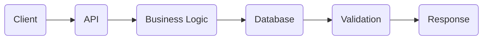
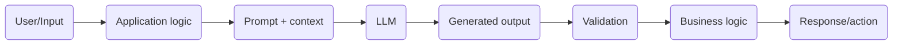

# LLMs - The basics

## How LLMs work

The model is the brain, but as in any other body, it doesn't work alone.
LLMs only make probabilistic predictions about the next token, so it's the user's job to try and fine-tune the input and the environment around that brain to get more precise answers.

### Short analogy for developers

How REST applications are usually built:



In ontrast, this is how a typical basic LLM application is built:



The biggest difference is that while the traditional programing logic is deterministic, the LLM outputs are probabilistic, which cannot per se guarantee that the same input will always bring the same results.

## Tokens

LLMs do NOT "understand" you. The read and process tokens, no phrases.
Asking an AI application "Explain to me how Gen AI works in three short sentences" will not be directly "understood", but rather split into something like:

```
['Explain', 'to', 'me', 'how', 'Gen', 'AI', 'works', 'in', 'three', 'short', 'sentences'].
```

For the output it's the same. After the LLM processes your query, it will token-by-token check the highest probability given all the information it has received from you and its training, and pick them in sequence to form the result.

## Context

Context is every other piece of information that the LLM receives along with your input, in order to help it provide a more accurate answer.
It includes (but not limited to):

- System prompt: set by the developers of the AI platform/provider, it sets the ground rules and base instructions for that LLM. Usually contains things it is forbidden to do/say, and ways of working.
- Developer prompt: set by the developers of the AI application (that uses/consumes the AI platform/provider) to enforce additional rules or define custom specific behaviors depending on the usage or tasks this application will perform.
- User prompt: the user input/query.
- Conversation history: when available, represents the "memory" of the user <-> AI interactions on that session.
- Tool results: if any tool has been used, what was the output it brought.
- Documents: files made available for the brain to work with.

So, bad outcomes or answers are not necessarily a sign that you've chosen a bad model. It could be contradictions or imprecisions on everything that composes the information the LLM actually gets access too, which then influences the probabilistic mechanism and ultimately, what comes back to the user.

### Got a bad answer? Ask yourself:

- Was the input correct?
- Was the context sufficient?
- Was the relevant information retrieved?
- Were instructions clear?
- Was conflicting information supplied?
- Was the output constrained?
- Was the result validated?
- Was the model actually appropriate for this task?

## Hallucinations

### **LLMs don't care about the truth**

It's true, they are probabilistic engines fed with and trained on a huge amount of data and different information. That's what they "know". Their modus-operandis is to find for you the best combination (meaning the highest probable token-by-token sequence) of words for what yo asked it to do, based on how they were trained.

That alone makes it part of the user's job to ask themselves: **"Is this really true?"**, even when everything seems plausible. Because **plausibl;e** is fine for the LLM if their probabilities say so. And worse than that, if poorly instructed and lacking the actual information, the LLM might try to come up with anything to fill the gaps, in a way that it seems close enough to the unnatentive eye.

### So how do we prevent hallucinations?

The truth is: we can't, not completely.
But there are things we can do to reduce a lot its occurences and impacts, among which we have:

- Retrieval
- Grounding
- Structured outputs
- Validation
- Tool calls
- Source attribution
- Evaluation
- Guardrails
- Human approval

Just naming them for now to keep it in mind. Further details on following study days.
