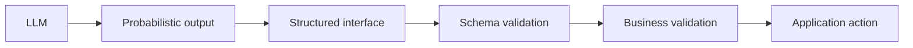
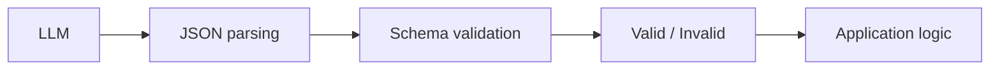
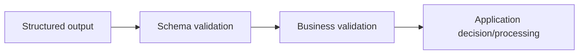

# Structured outputs & validation

## Engineering output validation

The premise we're working with is that LLMs, being probabilistic, will probably not, without proper instructions and configurations (application layer around it), provide structured outputs.

And why do we need structured outputs? Because that structure can be validated.

The engineering goal here is:



### Example

We have an AI application to help us classify customer support tickets.
Directly asking the LLM something like: **"Classify this customer support ticket: \<ticket\>"**, would potentially result in a sentence or explanation such as: **"This seems to be a billing issue because..."**.

Whereas if we define an interface, such as:

```json
{
  "category": "billing",
  "priority": "high",
  "confidence": 0.91,
  "evidence": "Customer reports an incorrect invoice."
}
```

We would have something to validate against, thresholds to be monitored, and a proper JSON structure to manipulate afterwards. So the LLM becomes a component behind an API contract.

## Structured output

There are different approaches to have an LLM provide its answers on a desired output structure, and how to handle cleanup if needed.

### 1. Prompt-only

During the context engineering, the LLM is instructed to **"All your replies should be valid JSON structures with these fields: \<fields\>"**.
This may work, as well as it may not.
It could omit fields, use wrong types, invent additional fields, or still produce things like:

```
Sure! Here's the JSON:

{
    ...
}
```

Prompting is just an instruction, not a guarantee of the outcome.

### 2. Parsing & validating

If prompt-only can produce hallucinations, text + JSON, or simply not fully follow the instruction, it can be paired with a parsing application layer afterwards that parses the JSON content from the LLM's reply, filtering out all the "extras" added by the AI.
The extracted JSON data can the be validated against a schema to ensure the LLM hasn't invented new things that were not supposed to be there in the first place. This validation will then be the boolean signal the application needs in order to decide what to do.



### 3. Provider/framework constrained structured output

Some model APIs can constrain generation to a schema or provide structured-output facilities.
That can substantially reduce the malformed output, but it cannot guarantee the correctness of the data in it.
Even responses that satisfy the schema validation, can be wrong data-wise.

For example, if there's a urgent ticket for a security incident, and the LLM classifies and outputs it as follows:

```json
{
  "category": "billing",
  "priority": "low",
  "confidence": 0.99
}
```

Supposing this passes the schema validation, the classification is completely wrong.

## Schema validity vs business validity

A critical distinction for the proper working of an AI application, because althought structured outputs can be validated against a schema for its format, it is the business validation that says what actually makes sense in terms of behavior.

Expanding on the security incident ticket example above. It passes the schema, but with wrong data and wrong classification, so it would be naive to simply trust the AI and let that data into our database.

But let's assume that the LLM actually classified the ticket correctly:

```json
{
  "category": "security",
  "priority": "low",
  "confidence": 0.95,
  "evidence": "Someone has gained unauthorized access to my account."
}
```

And that we have a business rule that defines:

> Security issues must have priority => high.

This ticket would fail business validation. That doesn't necessarily mean that the model got the priority wrong, but routes the processing to a different path within the application.

So the process would be something like:



## Failure classes

In such workflows, there are at least 3 failure types to be identified and prevented.

### 1. Syntax failure

When the output iosn't parseable at all. Invalid JSON, for example:

```
{ "priority": "high"
```

### 2. Schema failure

Valid JSON structure, but invalid content, not matching the contract.

```
Contract

priority:
    low | medium | high
```

```json
{
  "priority": 42
}
```

### 3. Semantic/business failure

The output satisfies the syntax and the schema checks, but the data still fails the business validation.

For example, a urgent security issue is classified as:

```json
{
  "category": "billing",
  "priority": "low"
}
```

## Business validation types

### Cross-field rules

One field constrains another. For example:

```
category = security → priority cannot be low
```

```
status = approved → approver_id must exist
```

```
action = refund → refund_amount must be > 0
```

While the schema may allow all of these individually, the business validation layer checks their combination.

### Range/business limits

The schema determines the structure, the business determines the operational rules.

The schema says:

```
amount >= 0
```

The business says:

```
amount > 10,000 → requires human approval
```

### State-dependent rules

Supposing the AI application wants to cancel an order.
The LLM output could be:

```json
{
  "action": "cancel_order",
  "order_id": "12345"
}
```

Which is perfectly fine with the schema.
But the application will then check the order state against the business rule:

```
cancel_order → not permitted in states: 'shipped' | 'delivered'
```

### Confidence thresholds

This handles model uncertainty. When the LLM says, for example:

```json
{
  "category": "billing",
  "priority": "medium",
  "confidence": 0.43
}
```

The business validation can determine that:

```
confidence < 0.7 → require human review
```
