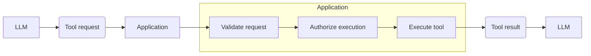
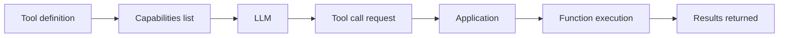

# Tool and function calling

Some LLM models support the use of external tools that execute specific tasks.
Using/calling a tool adds another layer to the processing schema of an AI application.



> **IMPORTANT**: The LLM **DOES NOT** execute the tool itself. It produces a request, the application interprets it, executes, and returns the results.

## Why it exists?

Without tools, the LLM can only produce answers based on its learned parameters, runtime context, and information supplied by the application.
If a customer asks: "What's the status of order C123456?", the model by itself cannot query the database to check that.

A possible workaround attempt could be to inject the order data into the prompt, like:

```
Customer:
C123456

Order status:
SHIPPED
```

But it would require the application to make the decisions beeforehand as to what data the model needs and gets.

With tool calling, the model can generate, for example, something like this:

```json
{
  "tool": "get_order_status",
  "arguments": {
    "customer_reference": "C123456"
  }
}
```

And the application layer then validates this request, checks authorization, executes the tool, gets and prepares the result, and returns the information to the model, which then processes it according to formulate the final answer.

This is basically the foundation for:

- database access
- APIs
- search
- calculators
- business systems
- workflow automation
- enterprise integrations
- agent actions

## Function execution

LLMs do not execute code functions, it's the application that exposes a description of the capabilities available.



> **IMPORTANT**: LLMs are probabilistic and may decide which tool to request and how to form (with which data) the request itself. Therefore, the application should **NOT** blindly trust it and directly execute without validations.

## The three steps

### 1. Tool selection

The **LLM** decides what tool to request -> this is **probabilistic**.

### 2. Tool request validation

The **application** decides if the request received is actually valid for the requested tool -> this is **deterministic**.

### 3. Tool authorization and execution

The **application** decides if the caller is allowed to perform that operation and if the operation makes sense and is safe to execute from a logical and business perspective -> this is **deterministic**.

These 3 put together give us:

```
LLM
 │
 │ proposes
 ▼
Tool call
 │
 │ validate
 ▼
Application
 │
 │ authorize
 ▼
Tool execution
 │
 ▼
External system
```

> The LLM is **never** the authorization layer.

## Read-only vs side-effecting tools

This is an important distinction, because both sides have different risk profiles and should be treated accordingly by the application.

Read-only tools do not change data, they bascially retrieve it, for example:

```
get_customer()
get_order()
search_documents()
get_invoice()
check_inventory()
```

Meanwhile, side-effecting tools, may perform operations that are potentially risky and destructive if not properly secured, like:

```
create_ticket()
send_email()
refund_payment()
delete_account()
change_customer_address()
create_purchase_order()
```

While some effects may be light and easily undone, such as creating wrong records, others have more destructive power and may cause bad side-effects, like delete operations.

## Tool descriptions

Tool descriptions matter. They become part of the model's decision context and help it choose properly.

Therefore, they should be carefully crafted to be as accurate and semantically useful as possible to avoid confusion and unintended tool selection.

What a poor tool description looks like:

```
Call 'get_customer' to get data.
```

While a good one would be closer to this:

```
Retrieve customer information using the customer reference.
Use this tool when the user asks for information about an existing
customer.
```

If a tool must only be called under certain conditions, it's the application's job to enforce that.

> Tool descriptions are not security controls! (Remember context engineering)

## Tool schemas

They are the contracts used by the tool, it validates **shape**, it doesn't enforce authorization or business validity.
Schemas serve several purposes, among which:

- telling the model what the tool does
- telling the model which arguments exist
- constrains expected argument structure
- giving the application something deterministic to validate

Example of schema:

```json
{
  "name": "get_order_status",
  "description": "Retrieve the current status of a customer order.",
  "parameters": {
    "type": "object",
    "properties": {
      "customer_reference": {
        "type": "string"
      }
    },
    "required": ["customer_reference"]
  }
}
```
